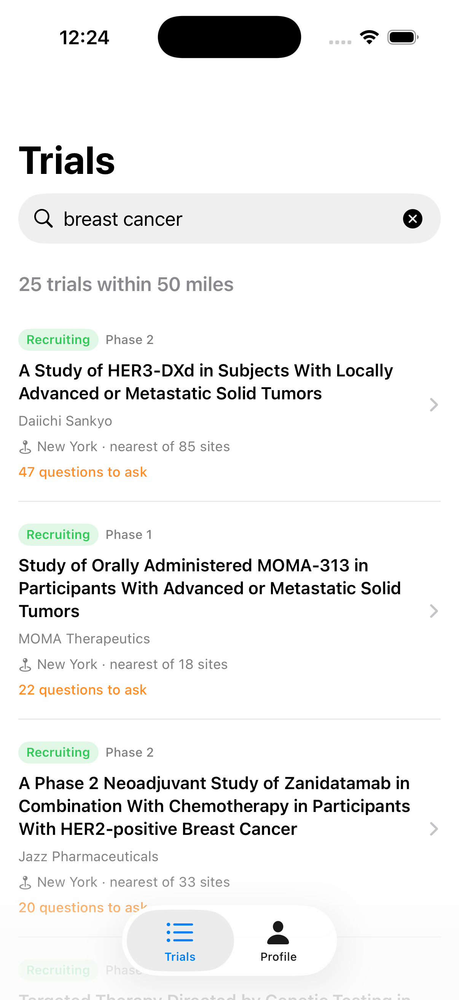

# Trialhead

**An iOS app that helps patients and caregivers find nearby clinical trials — and walk into the conversation already knowing what to ask.**



---

## The problem

ClinicalTrials.gov publishes every recruiting trial in the US through a free API. Almost every field comes back neatly structured — status, phase, sponsor, sites, enrollment.

Except the one that matters most. **Eligibility criteria arrive as a single blob of unstructured clinical prose:**

```
Inclusion Criteria:

* Histologically confirmed disease for each treatment arm as follows:
   1. Treatment Arm 1 (MOMA-313 Monotherapy)
      \- Advanced, relapsed or metastatic solid tumors ... with any HR-deficient alteration.
* ECOG PS ≤ 2
* Adequate organ function per local labs
...
```

That blob is why searching for a trial is miserable. Anyone can filter by condition and location; nobody helps you answer *"does this actually apply to me?"*

Trialhead turns that text into a structured checklist of **questions worth asking**, and puts the study coordinator's phone number one tap away.

## How it works

Three deterministic stages. **No server, no AI model, no data leaving the device.**

| Stage | What it does |
|---|---|
| **1 — Split** | Breaks the criteria blob into individual rules, preserving nesting |
| **2 — Categorise** | Sorts each rule by keyword and numeric patterns — age, lab value, prior treatment, pregnancy… |
| **3 — Evaluate** | Compares each rule against an on-device profile → green / amber / red |

The person's health details never leave their phone, because stage 3 is plain local logic and stages 1–2 only process public trial text.

## What the measurements changed

The interesting part of this project wasn't building the parser — it was what testing it revealed.

**Stage 1 splits 96% of studies cleanly**, measured on a 45-study holdout of conditions the parser was never tuned against. (It scores 100% on the corpus it *was* tuned against, which is exactly why that number isn't the one quoted.)

**Only 13.5% of eligibility rules can be answered automatically.** Measured across 609 rules. The other 86.5% need bloodwork, imaging, or a clinician's judgement — they genuinely cannot be resolved from anything a user can reasonably be asked to type.

That killed a feature. The original design put a fit-score badge on every search result — `9 likely · 3 to ask · 0 blockers`. But when every trial scores roughly 13/87/0, the badge looks informative while distinguishing nothing. It was replaced with location and a question count, and **the whole app was reframed from an eligibility calculator into a preparation tool.**

A second measurement bent the design again: site coordinates from ClinicalTrials.gov are **city-level, not street-level** — every "New York" site shares one coordinate. So distance can't differentiate trials within a metro area, and showing "0.1 mi" was invented precision. Cards now lead with the city name.

## Design rules

1. **Never assert eligibility.** Only the study team can determine that, after screening.
2. **Verbatim source text is always one tap away.** The parser is a navigation aid over authoritative text, never a replacement.
3. **Health data never leaves the device.** No account, no server, no analytics on health fields.
4. **When uncertain, always amber — never red.** Wrongly telling someone they're disqualified could stop them pursuing a trial that would have helped them. Only age and sex, which come from exact fields in the trial record, can produce a firm "no."
5. **A screen full of amber is a success.** It means someone is prepared.

## Repository layout

```
DESIGN.md            The full design document — decisions, wireframes, open questions
Trialhead/           The iOS app (SwiftUI, no third-party dependencies)
  Core/                Parser, categoriser, evaluator, API client — zero UI imports
  Views/               Screens
trialhead-spike/     Command-line research tool used to validate the approach
  NOTES.md             Milestone-by-milestone findings
  samples/             50 real criteria blobs (tuning corpus)
  samples-holdout/     45 more from unseen conditions (honest scoring)
```

The `Core/` files carry no UI framework imports, which is why they compiled into the iOS app from the command-line tool without a single edit.

## Running it

**The app** — open `Trialhead/Trialhead.xcodeproj` in Xcode and press Run. Requires Xcode 16+.

**Regenerating the app icon:** `swift tools/make-icon.swift Trialhead/Trialhead/Assets.xcassets/AppIcon.appiconset/AppIcon.png` — the mark is drawn in code rather than exported from a design tool, so it can be tweaked and rebuilt without hunting for a source file.

**The research tool:**

```bash
cd trialhead-spike
swift build
./.build/debug/TrialheadSpike score                    # grade the parser across the corpus
./.build/debug/TrialheadSpike split NCT01984762        # split one study's criteria
./.build/debug/TrialheadSpike evaluate NCT01984762 diabetes   # full pipeline on live data
./.build/debug/TrialheadSpike measure                  # verdict distribution
```

## Status

Milestones M0–M3 complete: the API is verified, the parser is measured, and the app runs against live data.

Next up — persisting the profile between launches, a proper first-run setup flow, saved trials, and a map of study sites.

## Data source

[ClinicalTrials.gov API v2](https://clinicaltrials.gov/data-api/api), a free public service of the U.S. National Library of Medicine. No API key required.

---

> **This is not medical software.** It displays public information and helps organise questions. It does not diagnose, treat, recommend, or determine eligibility for anything. Only a study team can decide whether someone can join a trial.
